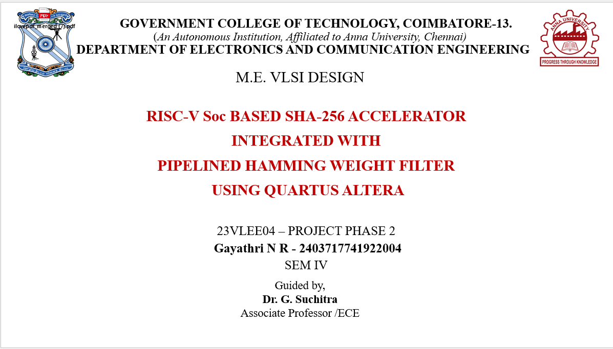
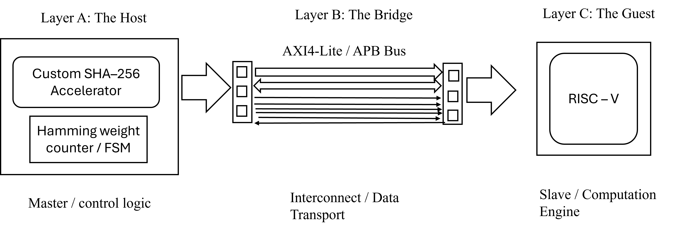
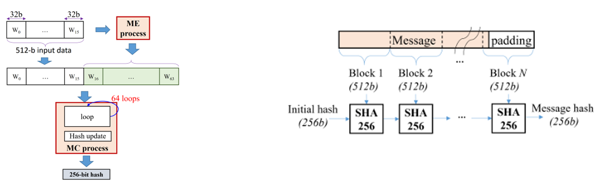
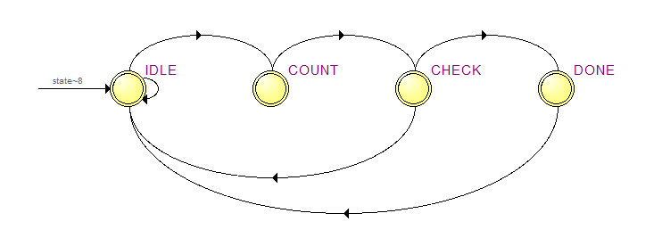
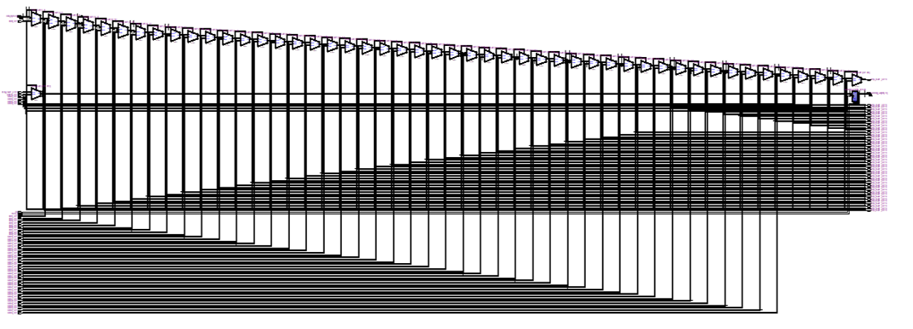
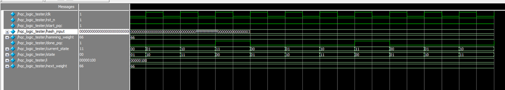
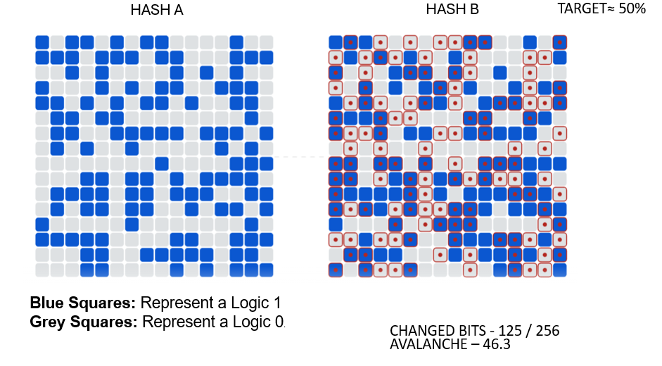
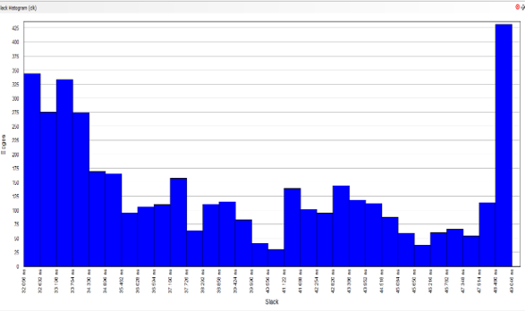
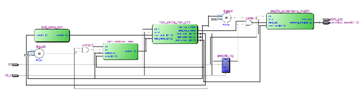

<div align="center">



# RISC-V SoC SHA-256 Accelerator
## with Pipelined Hamming Weight Filter for HQC-128 Post-Quantum Cryptography

[](https://www.intel.com/content/www/us/en/products/details/fpga/cyclone/iv.html)
[](https://en.wikipedia.org/wiki/Verilog)
[]()
[]()
[]()

**250× faster than software · 99.6% latency reduction · NIST FIPS 180-4 compliant · FPGA validated at 50 MHz**

*M.Tech VLSI Design Project | Government College of Technology, Coimbatore | Published at NCACCS'26*

</div>

---

## ⚡ Performance at a Glance

<div align="center">

| Metric | Software Baseline | This Hardware | Gain |
|:---|:---:|:---:|:---:|
| Execution Latency | ~20,000 cycles | **80 cycles** | 🚀 **250×** |
| CPU Load | 100% (blocked) | **~0% (free)** | ♾️ |
| Throughput | — | **1.024 Gbps** | — |
| Setup Slack | — | **+32.063 ns** | ✅ |
| Hold Slack | — | **+0.459 ns** | ✅ |
| Total Negative Slack | — | **0.000 ns** | ✅ |
| Avalanche Effect | — | **46.3%** | ✅ |
| HQC-128 Hamming Weight | Target: 66 | **0x42 = 66** | ✅ |

</div>

---


## 📌 Project Overview

This project implements a **hardware-software co-design** on a 32-bit **Pulpino RISC-V SoC** that eliminates the *software hashing bottleneck* in post-quantum cryptographic systems. A custom SHA-256 accelerator — tightly integrated with a pipelined Hamming weight filter — performs autonomous **rejection sampling** for HQC-128 entirely in hardware, freeing the processor from bitwise-heavy computation.

The design is **physically validated** on an Altera DE2-115 Cyclone IV FPGA at 50 MHz, demonstrating real-world timing closure and silicon readiness.

> 📄 **Conference Paper:** *SHA-256 Accelerator with Pipelined Hamming Weight Filter for RISC-V SoC* — NCACCS'26, GCT Coimbatore, March 2026

---

## 🏗️ System Architecture

<div align="center">

<br><i>Figure 1: Three-layer hardware-software co-design on Pulpino RISC-V SoC</i>
</div>

<br>

The system is organized into three layers:

```
┌──────────────────────────────────────────────────────────────┐
│          Layer A — Host: RISC-V Processor (Master)           │
│          Pulpino RI5CY Core · RV32IMC · 4-stage pipeline     │
└─────────────────────────┬────────────────────────────────────┘
                          │  APB / AXI4-Lite
┌─────────────────────────▼────────────────────────────────────┐
│          Layer B — Bridge: Memory-Mapped Interconnect        │
│          Quartus Platform Designer · Address Decoder         │
└─────────────────────────┬────────────────────────────────────┘
                          │
┌─────────────────────────▼────────────────────────────────────┐
│          Layer C — Guest: SHA-256 + Hamming Accelerator      │
│          64-round FSM · 8-stage Pipelined Adder Tree         │
└──────────────────────────────────────────────────────────────┘
```

| Module | Role |
|:---|:---|
| `u_riscv_core` | Pulpino RI5CY 32-bit master controller |
| `u_rom` | Boot ROM — stores firmware (Hex), triggers PQC at startup |
| `u_ram` | Data RAM — Harvard architecture, single-cycle read latency |
| `u_sha256` | SHA-256 accelerator — 64-round compression + Hamming pipeline |

---

## ⚙️ SHA-256 Accelerator Design

<div align="center">

<br><i>Figure 2: SHA-256 block-level architecture — preprocessing to final digest</i>
</div>

<br>

| Block | Function |
|:---|:---|
| **Padding & Pre-processing** | Formats raw input into 512-bit blocks (NIST FIPS 180-4) |
| **Message Expansion (ME)** | Expands 16 × 32-bit words (W0–W15) → 64-word schedule (W16–W63) |
| **Message Compression (MC)** | 64 iterative rounds using Ch, Maj, Σ0, Σ1 functions |
| **Hash Update & Output** | Produces final 256-bit digest |

---

## 🔄 FSM State Machine

<div align="center">

<br><i>Figure 3: 4-state PQC FSM — IDLE → COUNT → CHECK → DONE</i>
</div>

<br>

| State | Encoding | Trigger | Action |
|:---|:---:|:---|:---|
| **IDLE** | `2'b00` | `start_pqc = 0` | Low-power wait; registers cleared |
| **COUNT** | `2'b01` | `start_pqc = 1` | SHA-256 rounds + adder tree run in **parallel** |
| **CHECK** | `2'b10` | `pipe_delay_cnt = 8` | Compare `hamming_weight` vs target (66 / 0x42) |
| **DONE** | `2'b11` | `hamming_weight = 0x42` | Assert `done_pqc = HIGH`; CPU reads result via APB |

If weight ≠ 66, the FSM loops back to IDLE **autonomously** — the CPU is never interrupted.

---

## 🔁 Pipelined Balanced Adder Tree

<div align="center">

<br><i>Figure 4: 8-stage pipelined balanced adder tree for Hamming weight computation</i>
</div>

<br>

```
256-bit Hash Input
 ├── Stage 1: 128 adders  →  128 × 2-bit partial sums
 ├── Stage 2:  64 adders  →   64 × 3-bit partial sums
 ├── Stage 3:  32 adders  →   32 × 4-bit partial sums
 ├── Stage 4:  16 adders  →   16 × 5-bit partial sums
 ├── Stage 5:   8 adders  →    8 × 6-bit partial sums
 ├── Stage 6:   4 adders  →    4 × 7-bit partial sums
 ├── Stage 7:   2 adders  →    2 × 8-bit partial sums
 └── Stage 8:   1 adder   →   Final Hamming Weight (scalar)
```

**Why pipelined?** Pipeline registers between stages cut the critical path, allowing one new hash result to enter every clock cycle while all 256 bits are counted in parallel — no software loops, no CPU stalls.

---

## 📊 Simulation Results

<br>

| Phase | Key Signals | Action |
|:---|:---|:---|
| System Init | `rst_n = 1`, `clk` toggling | SoC powers on, clock stabilizes |
| Firmware Boot | `instr_rdata = ...10011` | CPU fetches C-code from Boot ROM |
| APB Addressing | `paddr = 0x4...`, `psel = 1` | CPU selects SHA-256 accelerator |
| Message Offload | `pwdata = 1111...`, `penable = 1` | CPU writes input message to accelerator |
| Parallel Compute | `clk` toggling | SHA-256 FSM + adder tree run simultaneously |
| PQC Match | `hamming_weight stable`, `done_pqc = 1` | HQC-128 target weight 66 confirmed ✅ |

### Hamming Weight Verification

<div align="center">

<br><i>Figure 6: Simulation output — hamming_weight = 0x42 (decimal 66), done_pqc asserted HIGH</i>
</div>

---

## 🔐 Security Verification — Avalanche Effect

<div align="center">

<br><i>Figure 7: Avalanche effect test — 1-bit input change produces 125/256 output bit flips (46.3%)</i>
</div>

<br>

A single-bit change in the input message was applied between Hash A and Hash B:

- **Bits changed:** 125 / 256
- **Avalanche effect:** **46.3%** (target ≈ 50%)
- **Result:** Cryptographic integrity of SHA-256 implementation **confirmed** ✅

---

## 📈 Static Timing Analysis (STA)

<div align="center">

<br><i>Figure 8: Quartus TimeQuest STA — zero TNS, positive setup and hold slack</i>
</div>

<br>

| Timing Metric | Requirement | Achieved | Status |
|:---|:---:|:---:|:---:|
| Setup Slack | > 0 ns | **+32.063 ns** | ✅ Pass |
| Hold Slack | > 0 ns | **+0.459 ns** | ✅ Pass |
| Total Negative Slack (TNS) | 0 ns | **0.000 ns** | ✅ Pass |
| Throughput | ~1.3 Gbps | **1.024 Gbps** | ✅ Pass |
| Execution Latency | < 20,000 cycles | **80 cycles** | ✅ 250× gain |

---

## 🖥️ FPGA Physical Validation

<div align="center">

<br><i>Figure 9: Altera DE2-115 Cyclone IV FPGA — Green LED (LEDG6) lit = valid HQC-128 hash found</i>
</div>

<br>

**Board:** Altera DE2-115 (Cyclone IV) · **Clock:** 50 MHz on-board oscillator

| Signal | FPGA Pin | I/O | Indicator |
|:---|:---:|:---|:---|
| `done_pqc` | PIN_G6 | LEDG6 | 🟢 Green = valid hash found |
| `hamming_weight[7:0]` | PIN_V17–PIN_H16 | LEDR7–LEDR0 | Binary weight display |
| `clk` | PIN_Y2 | 50 MHz oscillator | System clock |
| `rst_n` | PIN_M23 | KEY0 push button | Active-low reset |

### RTL Schematic

<div align="center">

<br><i>Figure 10: RTL netlist schematic — u_riscv_core, u_rom, u_ram, u_sha256 interconnect</i>
</div>

---

## 🆚 Proposed vs Base Paper Architecture

| Feature | Base Paper | **This Project** |
|:---|:---|:---|
| Control Paradigm | Pure hardware FSM | **RISC-V HW/SW co-design** (reprogrammable) |
| Hash Algorithm | Keccak (SHA-3) | **SHA-256** (NIST FIPS 180-4) |
| System Interconnect | AXI Stream (complex, high area) | **APB / Memory-Mapped I/O** (area-efficient) |
| PQC Arithmetic | Polynomial PEs (Kyber/Dilithium) | **Pipelined Hamming filter** (HQC-optimized) |
| Memory Architecture | Shared RAM banks | **Harvard** (Boot ROM + Data RAM) |
| Flexibility | Fixed hardware only | **Firmware-updatable via ROM** |

---

## 🔌 APB Interface & Memory Map

| Register | Direction | Purpose |
|:---|:---:|:---|
| `CONTROL_REG` | CPU → Accelerator | CPU writes `start_pqc` to begin hashing |
| `STATUS_REG` | Accelerator → CPU | CPU polls `done_pqc` completion flag |
| `DATA_REG[255:0]` | Accelerator → CPU | CPU reads final 256-bit hash digest |

---

## 🛠️ Tools & Technology Stack

| Category | Tool / Standard |
|:---|:---|
| HDL | Verilog HDL |
| FPGA IDE | Quartus Altera Prime |
| Simulation | ModelSim |
| FPGA Platform | Altera DE2-115 (Cyclone IV) |
| Processor Core | Pulpino RI5CY (RV32IMC, ETH Zurich / Univ. Bologna) |
| Bus Protocol | APB (Advanced Peripheral Bus), AXI4-Lite |
| Cryptographic Standard | NIST FIPS 180-4 (SHA-256) |
| PQC Reference | HQC-128 (NIST PQC Round 4) |
| Target Clock | 50 MHz |

---

## 📁 Repository Structure

```
riscv-sha256-accelerator/
│
├── rtl/
│   ├── sha256_core.v          # 64-round SHA-256 compression engine
│   ├── hamming_pipeline.v     # 8-stage pipelined balanced adder tree
│   ├── apb_slave.v            # APB memory-mapped interface
│   ├── fsm_pqc.v              # 4-state PQC FSM (IDLE/COUNT/CHECK/DONE)
│   ├── u_rom.v                # Synchronous Boot ROM
│   ├── u_ram.v                # Synchronous Data RAM
│   └── top.v                  # SoC top-level integration
│
├── tb/
│   └── tb_sha256_top.v        # Testbench with APB stimulus
│
├── constraints/
│   └── de2_115.qsf            # Quartus pin assignments (DE2-115)
│
├── reports/
│   ├── timing_report.txt      # STA results (setup / hold / TNS)
│   └── resource_utilization.txt
│
├── images/
│   ├── banner.png             # Project banner
│   ├── system_architecture.png
│   ├── sha256_block_diagram.png
│   ├── fsm_diagram.png
│   ├── adder_tree.png
│   ├── waveform_fsm.png       # ModelSim simulation waveform
│   ├── hamming_weight_result.png
│   ├── avalanche_effect.png
│   ├── sta_report.png         # Quartus TimeQuest screenshot
│   ├── fpga_board.png         # DE2-115 board photo
│   └── rtl_schematic.png      # Quartus RTL viewer screenshot
│
└── README.md
```

---

## 🔮 Future Scope

| Enhancement | Description |
|:---|:---|
| **DFT Integration** | Add LBIST (LFSR + MISR) around SHA-256 accelerator for stuck-at fault detection at speed |
| **ASIC Tape-out** | Transition to 45nm/90nm CMOS standard-cell flow — floorplan, CTS, routing, power analysis |
| **Algorithm Expansion** | Extend to NIST PQC Kyber and Dilithium using the existing RISC-V + APB infrastructure |

---

## 📚 References

1. NIST, *"FIPS 180-4: Secure Hash Standard (SHS),"* 2015.
2. Aguilar Melchor, C., et al., *"Hamming Quasi-Cyclic (HQC),"* NIST PQC Submission, 2021.
3. Chaves, R., et al., *"A High-Speed Pipelined Hardware Architecture for SHA-256,"* IEEE TVLSI, 2006.
4. Ge, S., et al., *"Accelerating Cryptographic Primitives on RISC-V via HW/SW Co-Design,"* 2020.
5. C-DAC, *"Processor Series: HW/SW Co-Design for Indigenous SoC Development,"* 2024.
6. Sharma, K., et al., *"CRYPTONITE: Scalable HW Accelerator for Cryptographic Primitives,"* arXiv:2505.14657, 2025.
7. Karl, P., et al., *"High-Performance FPGA Accelerator for CROSS,"* IACR ePrint 2025/1161, 2025.
8. Li, K., et al., *"Efficient Post-Quantum Crypto-Processor for FrodoKEM,"* arXiv:2601.16500, 2026.

---

## 👩‍💻 Author

<div align="center">

**N R Gayathri**
M.Tech VLSI Design · Government College of Technology, Coimbatore

[](mailto:nrgayu2002@gmail.com)
[](https://linkedin.com/in/n-r-gayathri)

*Guided by Dr. G. Suchitra, Associate Professor, ECE Dept., GCT Coimbatore*

*Published at NCACCS'26 · March 2026*

</div>

---

<div align="center">
<sub>⭐ If this project helped you, consider starring the repository!</sub>
</div>
